# 嵌入式linux实战项目：基于立创泰山派的网络AI摄像头

[TOC]

## 前言

前段时间刚刚完成了第一个嵌入式linux实战项目，因为是初学者，所以前期耗费了许多力气，写这篇文章的目的一是分享该项目的全部细节，二也是相当于做了一个笔记，记录学习的历程，以后也可以用作复习。如有可以继续改进之处，还请各位大佬指点。

主要基于**立创泰山派rk3566**，**buildroot+rockit+rknn+ZLMediaKit**实现**摄像头实时采集+YOLOv5检测+硬件编码+实时推流**的功能。

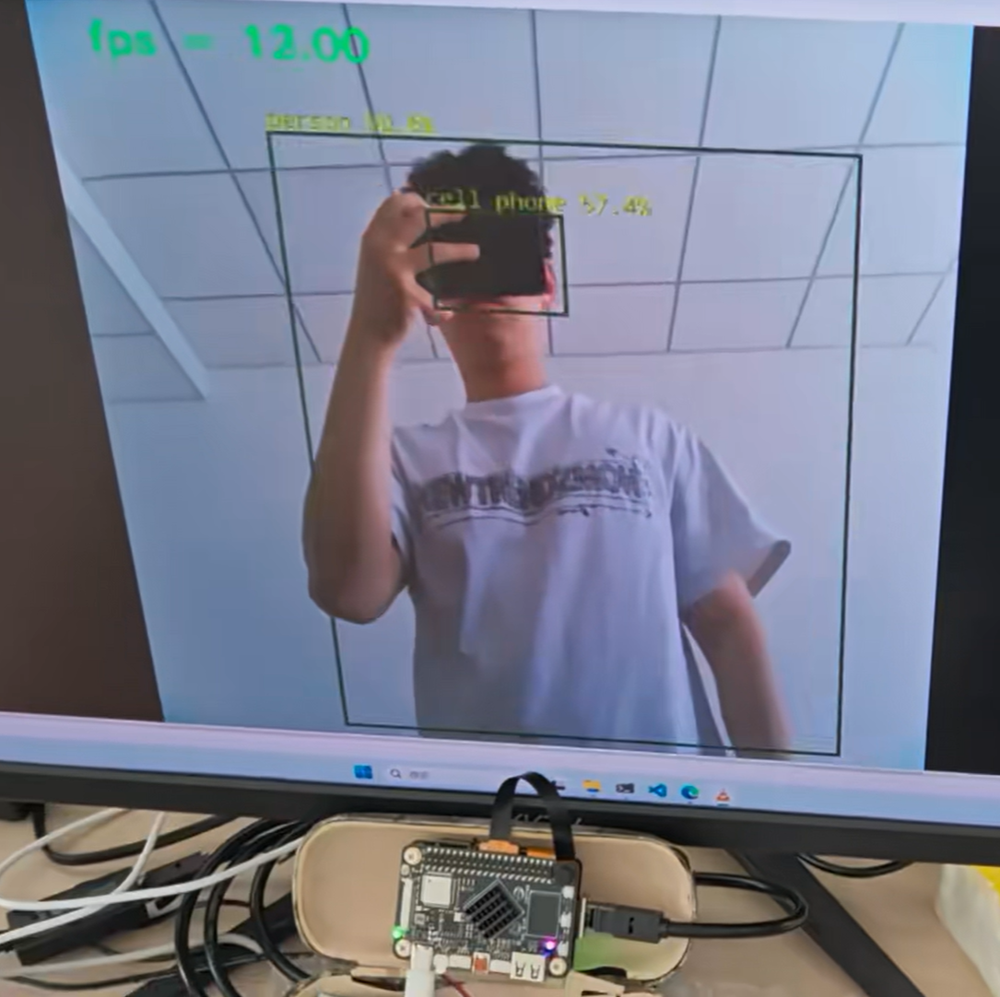

开源地址：[Code0bug/RK3566-AI-Camera-v1](https://gitee.com/lzp1733149755/rk3566-ai-camera-v1)

演示视频：[【开源】泰山派实战项目 | AI网络摄像头｜mipi摄像头实时采集进行yolov5目标检测并进行rtsp实时推流_哔哩哔哩_bilibili](https://www.bilibili.com/video/BV1WMR6YwEHB/?spm_id_from=333.1387.0.0&vd_source=c053026cfad6feccbe86fd46e528c91a)

## 一、项目整体架构

### 1.硬件组成

硬件包含三个部分：**泰山派rk3566开发板**，**泰山派扩展板**和一个**MIPI摄像头**，然后还需要**一根网线**，一端连扩展板，一端连电脑。

使用扩展板是因为泰山派开发板上面没有网口，这挺头疼的，因为博主使用的是网线和电脑连接，这样推流实时性会高一些。当然理论上使用WIFI让开发板和电脑在同一局域网下也是可以的，不过buildroot系统下的wifi博主没有试过，有兴趣的小伙伴们可以试一下。

**使用扩展板时，需要更新内核**，否则缺少网口的驱动，网口自然也就不能使用了，这点挺重要的，后面会讲。

MIPI摄像头使用的是OV5695，购买链接如下：

https://item.taobao.com/item.htm?id=690216988471&_u=p207tmorq669a7


博主建议买这个定焦的就够了（因为我用自动对焦的烧坏了一个，镜头发生了畸变），视频采集效果应该都是差不多的。

摄像头和开发板的硬件接线如下：


### 2.系统框图

为了方便大家一眼就能了解本项目的硬件软件结构和全部功能，我画了一个系统框图如下：


哈哈其实没什么硬件结构，这个项目主要还是软件部分比较多。

其中视频采集和硬件编码都是使用rockit，YOLOv5推理使用的是rknn，推流使用的是ZLMediaKit，这些后面都会挨个具体介绍。


## 二、buildroot系统构建和依赖环境配置

下面就是环境配置，其实对于博主这样的小白，在环境配置上面花的时间是最多的，也是这一块让我反复纠结，头痛。这里的内容也比较枯燥乏味且耗时，但我认为这里恰恰反映了基础的重要性，包括了linux系统组成，交叉编译，动态库静态库等等诸多基础知识。将这一块搞明白了，后面就可以轻松的构建我们的代码工程。

### 1.buildroot构建linux系统

首先说为什么用buildroot而不用ubuntu。ubuntu更适合桌面系统，较为占资源。而在资源有限的嵌入式平台中，一般使用buildroot来构建定制化的linux系统，这样可以节省资源，当然，对于初学者来说，buildroot比ubuntu更加难上手。**这一块的内容我会结合立创官方的资料来讲，因为很多部分官方资料里已经有了，博主就不重复步骤了。**

#### 1.1 系统烧录

一个完整的linux系统包含uboot，linux内核（设备树驱动），根文件系统。uboot是用来启动linux内核的；linux内核里包含设备树驱动，如果开发板上需要适配新的硬件，就需要在设备树里进行配置，就比如我们加了一扩展板，我们想用扩展板上的网口，那么就需要更新linux内核，这一块就是嵌入式linux驱动开发；根文件系统里包含了系统依赖的各种库，命令等等，我们这个项目是一定要用到opencv的，所以添加opencv就需要重新编译根文件系统。

系统烧录我总结了两种方法：

1.完整编译linux系统，打包成镜像进行烧录

2.烧录官方buildroot镜像，然后单独编译内核和buildroot根文件系统，单独烧录内核和根文件系统。

完整编译linux系统太过耗时，这里我使用的是第二种方法，单独编译内核和根文件系统并烧录。

那么现在就开始执行第一步，系统烧录，可以在下载资料里找到buildroot的系统镜像，然后按照官方教程进行镜像烧录，具体链接如下：

https://wiki.lckfb.com/zh-hans/tspi-rk3566/system-usage/img-download.html

#### 1.2 更新内核

因为我们使用了扩展板，上面下载的系统镜像里是没有扩展板的驱动的，这时候我们是没办法用网口的。

在下载资料：`项目案例-【底部扩展板】项目资料 -【底部39脚】4G......扩展板-Linux固件 - 方法一：单独更新内核 - boot.img`

这个boot.img就是更新了扩展板驱动的linux内核镜像，我们需要将他单独烧录进系统里，这个立创也有教程，在目录：`项目案例-胖妞手机-SDK编译-单独编译kenel`下

当然这个固件是立创已经提供好的，其实也可以手动添加立创提供的驱动文件，单独编译内核，然后再进行烧录，结果都是一样的。

#### 1.3 buildroot添加opencv和编译下载

接下来我们需用使用buildroot添加opencv并编译和下载根文件系统。在这之前，需要下载linux的sdk和buildroot相关库，这里建议直接参考立创的教程部分：

https://wiki.lckfb.com/zh-hans/tspi-rk3566/project-case/fat-little-cell-phone/sdk-compile.html#%E4%B8%8B%E8%BD%BDsdk

从`下载SDK`一直到`泰山派板级配置`，到这里足够了，我是把所有文件都放到了一个目录`linux_sdk`下，包含内容如下：

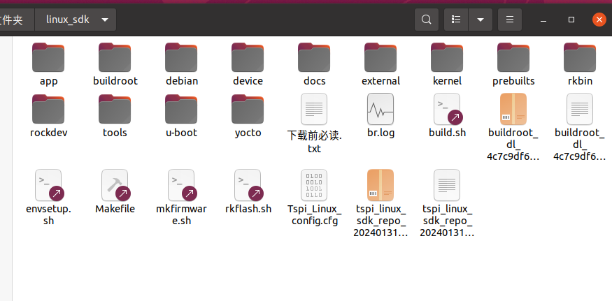

下面就开始添加opencv并单独编译根文件系统和烧录。

以下所有命令都是在`linux_sdk`这个目录下执行

首先进入buildroot的配置界面：

```shell
source buildroot/build/envsetup.sh # 选择65
make menuconfig
```

然后在出来的界面中依次选择

**`Target packages`** --> **`Libraries`** ---> **`Graphics`** ---> **`opencv3`** 将光标移动到opencv3上，点击键盘上的 'y' 键选择。

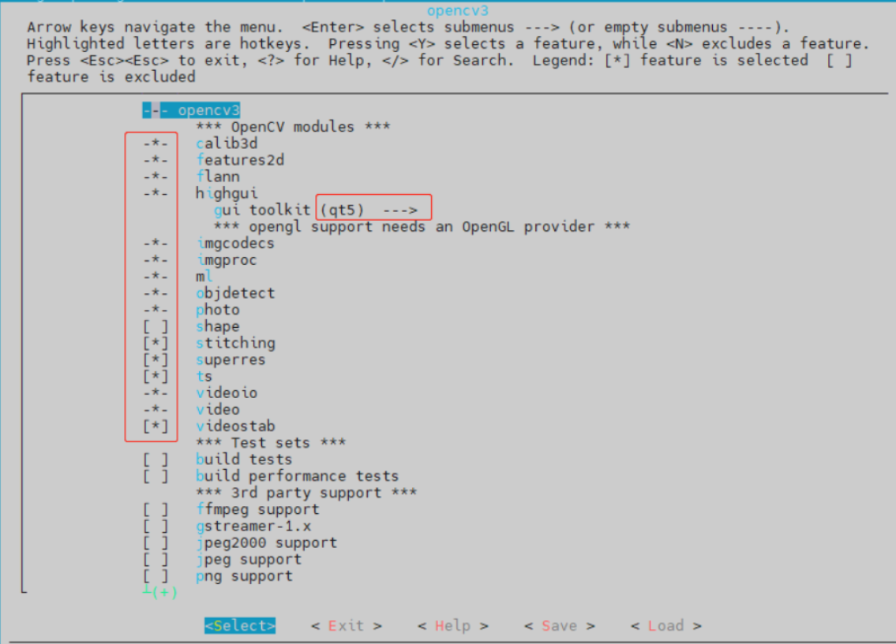

选好后在底下选`Exit`可以退出

然后输入命令保存配置

```shell
make savedefconfig
```

接下来就是单独编译根文件系统，在终端输入：

```shell
./build.sh rootfs
```

编译成功后`rockdev`目录下出现`rootfs.ext4`即为buildroot根文件系统

导入配置后只选择rootfs进行烧录

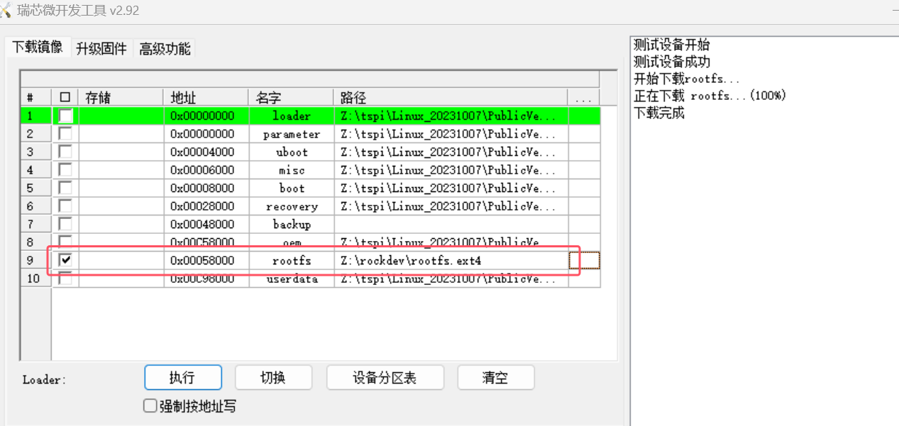

接下来顺便在说一下buildroot的结构：

`linux_sdk/buildroot/output/rockchip_rk3566/target`这个目录下就是要烧录进开发板里的根文件系统内容，可以在`usr/lib`下搜索opencv，成功添加的话这里会有添加的opencv库文件。

`linux_sdk/buildroot/output/rockchip_rk3566/host`这个目录下是buildroot为主机交叉编译提供的工具和依赖库。

在`linux_sdk/buildroot/output/rockchip_rk3566/host/bin`目录下的`aarch64-buildroot-linux-gnu-gcc`和`aarch64-buildroot-linux-gnu-g++`就是我们后面编译代码所需要用的交叉编译器。

`linux_sdk/buildroot/output/rockchip_rk3566/host/aarch64-buildroot-linux-gnu/sysroot/usr/lib`目录下包含了主机交叉编译需要依赖的库，

`linux_sdk/buildroot/output/rockchip_rk3566/host/aarch64-buildroot-linux-gnu/sysroot/usr/include`目录下包含了主机交叉编译需要的头文件


### 2.项目依赖环境配置

#### 2.1 rockit

首先说一说rockit是干什么用的。一开始的时候，博主想要通过OV5695这个摄像头来实时捕获图像，第一个想到的思路就是应该用v4l2框架来获取图像。但是尝试了一段时间后发现，这跟正点原子教程里的貌似不太一样，配置上有不少差异。然后在泰山派的交流群里发出提问，一位老哥跟我说用rockit。

rockit-mpi的官方文档里的说明如下：

```
Rockchip提供的媒体处理接口(Rockchip Media Process Interface,简称 RK MPI)，可支持应用软件快速开发。该平台整合了RK的硬件资源，对应用软件屏蔽了芯片相关的复杂的底层处理，并对应用软件直接提供接口完成相应功能。该平台支持应用软件快速开发以下功能：输入视频捕获、H.265/H.264/JPEG 编码 H.265/H.264/JPEG 解码、视频输出显示、视频图像前处理（包括裁剪、缩放、旋转）、智能、音频捕获及输出、音频编解码等功能。
```

简单来说，rockit就是提供了一接口，你只要导入相关的库，就可以直接利用这些接口（库函数），来实现视频捕获，视频编码等多种媒体资源处理。

rockit的全部资源就在sdk里，打开目录`linux_sdk/external/rockit`，如下：

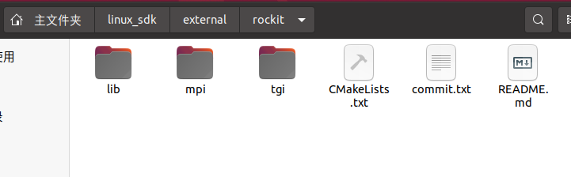

在`lib/lib64`目录下有一个`librockit.so`，这个就是rockit的动态库文件，后面我们构建工程的时候会用到。

`tgi`我们用不到，我们只需要关注`mpi`即可。在目录`mpi/doc`下有官方说明文档。

在目录`mpi/example/mod`下，有许多demo可供参考，比如我们要写一个视频捕获的程序，那么你就可以去参考一下该目录下的`test_mpi_vi.cpp`。

我们还需要关注的是目录`mpi/example/include`和`mpi/sdk/include`，这两个目录下包含着我们构建工程所需要的头文件。

好了，现在我们可以尝试编译一下rockit-mpi下的这些demo，这让可以帮助我们快速学习和上手rockit。

首先我们在**rockit目录**下新建一个build文件夹

```shell
mkdir build
```

同样是在该目录下，新建文件`toolchainfile.cmake`

```shell
vim toolchainfile.cmake
```

然后在该文件下输入以下内容：

```shell
# Example toolchain.cmake content
set(CMAKE_SYSTEM_NAME Linux)
set(CMAKE_SYSTEM_PROCESSOR aarch64)

# 交叉编译器地址
set(CMAKE_C_COMPILER "/home/lzp/linux_sdk/buildroot/output/rockchip_rk3566/host/bin/aarch64-buildroot-linux-gnu-gcc") # 自行修改
set(CMAKE_CXX_COMPILER "/home/lzp/linux_sdk/buildroot/output/rockchip_rk3566/host/bin/aarch64-buildroot-linux-gnu-g++") # 自行修改

# 设置目标系统根目录
set(CMAKE_FIND_ROOT_PATH /home/lzp/linux_sdk/buildroot/output/rockchip_rk3568/target/) # 自行修改

# 配置 CMake 查找程序和库文件的方式
set(CMAKE_FIND_ROOT_PATH_MODE_PROGRAM NEVER)
set(CMAKE_FIND_ROOT_PATH_MODE_LIBRARY ONLY)
set(CMAKE_FIND_ROOT_PATH_MODE_INCLUDE ONLY)
```

**注意，上面的交叉编译器地址和目标系统根目录是我的，你需要将其改成你自己的。**

然后进入build目录，开始编译

```shell
cd build
cmake .. -DCMAKE_TOOLCHAIN_FILE=../toolchainfile.cmake
make
```

编译成功如图：

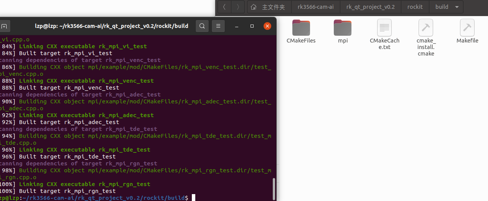

在上面图片中的目录`mpi/example/mod`下，就是这些demo编译出来的可执行文件啦。

编译完成之后，你还需要把`librockit.so`这个动态库文件拷贝到板端，然后再将编译出来的可执行文件拷贝到板端就可以执行了

```shell
# 注意自行切换到对应的目录下执行
adb push ./librockit.so /usr/lib  # 将依赖库文件拷贝到板端
adb push ./rk_mpi_vi_test /root # 将可执行文件拷贝到板端执行
```

然后再将编译出来的可执行文件拷贝到板端就可以执行了。

编译出来之后，在目录`mpi/example/common`下有一个`librt_test_comm.a`的静态库文件，这个我们在构建项目时也需要用到

总结一下关于rockit，构建项目需要用到哪些东西：

1.两个库文件：`librockit.so`和`librt_test_comm.a`

2.头文件：`mpi/example/include`和`mpi/sdk/include`下的头文件


最后再简单说一下为什么只需要把`librockit.so`拷贝到板端的`/usr/lib`下就可以运行程序，而不需要拷贝`librt_test_comm.a`。这两个一个是动态库文件，一般以`.so`为后缀，而以`.a`为后缀的是静态库文件。动态库文件是在你程序运行的时候进行链接，而静态库文件在编译过程中就已经把其中的内容全部编译进可执行文件里面了。程序执行时，会自动在`/usr/lib`下链接所需要的库文件。如果你不把`librockit.so`放在`/usr/lib`目录下，放在别处也是可以的，那么就要配置一下`LD_LIBRARY_PATH`这个环境变量。


#### 2.2 rknn

关于RKNN，网上的资料就多了去了，RKNN就是帮你把AI模型部署到板端运行的一套软件栈。

首先你需要下载两个东西：

一个是 `rknn-toolkit2`：https://github.com/airockchip/rknn-toolkit2，

还有一个是`rknn_model_zoo`：https://github.com/airockchip/rknn_model_zoo

`rknn-toolkit2`是为用户提供在计算机上进行模型转换、推理和性能评估的开发套件，而`rknn_model_zoo`里面有YOLOv5等AI算法的相关例程。

下载后将两个文件复制到虚拟机里面。在目录`rknn-toolkit2/doc`下，有官方的开发指南，建议直接跟着官方的文档先把RKNN熟悉一遍，把YOLOv5模型能在板子上跑通，这些内容直接看`01_Rockchip_RKNPU_Quick_Start_RKNN_SDK_V2.3.0_CN.pdf`这个文档，这里就不再赘述了。

注意，在编译那一步，交叉编译器就是改成sdk里面的那个

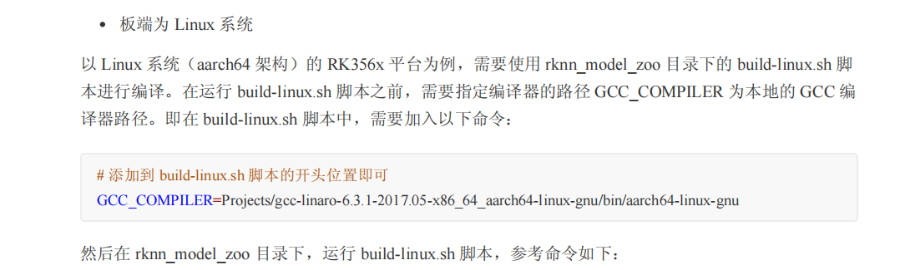

也就是`/home/lzp/linux_sdk/buildroot/output/rockchip_rk3566/host/bin/aarch64-buildroot-linux-gnu`。

跑通之后，我们直接来看后面构建项目工程需要rknn相关的哪些东西。

1.rknn模型和标签文件：用`rknn-toolkit2`将onnx转为rknn格式，得到`yolov5s_relu.rknn`，和标签文件`coco_80_labels_list.txt`，在编译成功后，会出现在目录`rknn_model_zoo/install/rk356x_linux_aarch64/rknn_yolov5_demo/model`下。

2.依赖库文件：编译出来后，rknn_model_zoo目录下会出现一个install，进入目录`install/rk356x_linux_aarch64/rknn_yolov5_demo/lib`,里面的两个库文件`librga.so`和`librknnrt.so`，这两个也是要拷贝到板端的`usr/lib`的。还需要一个静态库文件`libturbojpeg.a`，在目录`rknn_model_zoo/3rdparty/jpeg_turbo/Linux/aarch64`下

3.头文件和源文件：目录`utils`,

`3rdparty/librga`,

`3rdparty/rknpu2`,

`3rdparty/jpeg_turbo`,

`3rdparty/stb_image`，这些目录下的头文件源文件或include里面的头文件，

还有`rknn_model_zoo/examples/yolov5/cpp`下的相关头文件和源文件。

看着比较多且乱，不用担心，在我的开源项目里已经全部包含整理好了，这里只是告诉大家需要哪些东西。


#### 2.3 ZLMediaKit

项目中还需要将视频推流到电脑端，这部分使用的是`ZLMediaKit`，地址如下：

https://github.com/ZLMediaKit/ZLMediaKit

先来编译一下`ZLMediaKit`

进入`ZLMediaKit`的目录下，修改`CMakeList.txt`，加入如下代码：

```shell
# 指定交叉编译器（根据实际情况修改路径）
set(CMAKE_C_COMPILER /home/lzp/linux_sdk/buildroot/output/rockchip_rk3566/host/bin/aarch64-buildroot-linux-gnu-gcc)
set(CMAKE_CXX_COMPILER /home/lzp/linux_sdk/buildroot/output/rockchip_rk3566/host/bin/aarch64-buildroot-linux-gnu-g++)
```

也就是配置交叉编译器，和之前一样。

然后创建一个build目录，进入build目录，进行编译：

```shell
cd build
cmake ..
make
```

编译成功后如图：

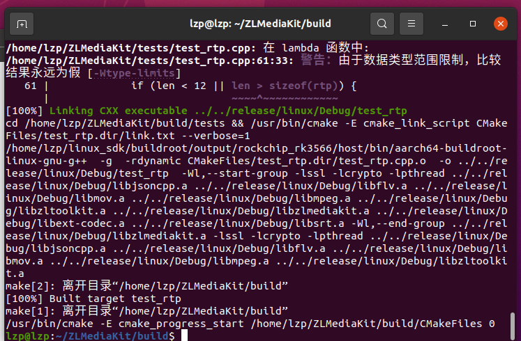

然后`ZLMediaKit`的目录下会出现一个`release`目录，进入目录`release/linux/Debug`，里面有一个`libmk_api.so`，这个就是我们需要的库文件。

然后还需要`ZLMediaKit`目录下的`api/include`里面的头文件。


好了，经过上面的步骤，我们已经有了rockit，rknn和ZLMediaKit的全部库文件和相关源码，下面就是他们都拼到一个cmake项目里，配置好环境后就可以开始写我们这个AI网络摄像头的代码了。


### 3.板端静态ip配置

我们推流使用网线在传输的，所以要设置板子的ip地址，并且这个ip要和电脑的ip在同一网段。

adb进入板端命令行：

查看是否存在以太网接口eth0

```shell
ifconfig -a
```

启动eth0

```
ifconfig eth0 up
```

查看是否启动成功，出现eth0即是启动成功，如果没有，说明你没有更新扩展板的内核

```
ifconfig
```

设置ip

```shell
ifconfig eth0 192.168.1.100 netmask 255.255.255.0
```

可以将以下内容放到`/etc/init.d/rcS`开机自动配置

```shell
ifconfig eth0 up
ifconfig eth0 192.168.1.100 netmask 255.255.255.0
```

然后将电脑的ip设置成同一网段，比如我这边设置开发板的ip地址是`192.168.1.100`，那么我电脑的ip地址就必须是`192.168.1.xxx`


## 三、代码实现

### 1.Cmake项目构建

这里的话大家直接下载我开源的项目就可以了，所需要的依赖库和文件我已经全部整理到项目里了，如下图：

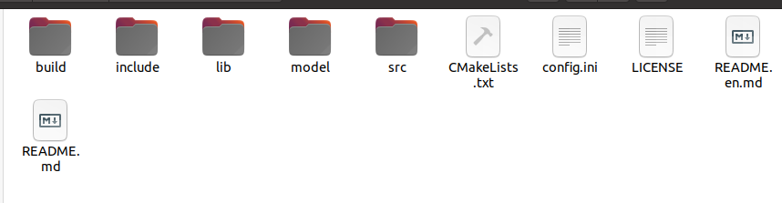

include里面包含全部的头文件，lib里包含全部的库文件，src里包含全部的源码，model里是rknn格式的模型文件。

CMakeLists.txt内容如下：

```cmake
# 指定CMake的最低版本要求
cmake_minimum_required(VERSION 3.10)

# 设置项目名称
PROJECT(rk_cmake_project)

# 设置C++标准
set(CMAKE_CXX_STANDARD 11)
set(CMAKE_CXX_STANDARD_REQUIRED True)

# 指定交叉编译器（根据实际情况修改路径）
set(CMAKE_C_COMPILER /home/lzp/linux_sdk/buildroot/output/rockchip_rk3566/host/bin/aarch64-buildroot-linux-gnu-gcc)
set(CMAKE_CXX_COMPILER /home/lzp/linux_sdk/buildroot/output/rockchip_rk3566/host/bin/aarch64-buildroot-linux-gnu-g++)

# 添加头文件路径
include_directories(
    ${CMAKE_SOURCE_DIR}/include
    # mpi 相关头文件
    ${CMAKE_SOURCE_DIR}/include/mpi/example
    ${CMAKE_SOURCE_DIR}/include/mpi/sdk
    # rknn 相关头文件
    ${CMAKE_SOURCE_DIR}/include/rknn/rknpu2
    ${CMAKE_SOURCE_DIR}/include/rknn/utils
    ${CMAKE_SOURCE_DIR}/include/rknn/yolov5
    ${CMAKE_SOURCE_DIR}/include/rknn/librga
    ${CMAKE_SOURCE_DIR}/include/rknn/stb_image
    ${CMAKE_SOURCE_DIR}/include/rknn/jpeg_turbo
    # ZLMediaKit 相关头文件
    ${CMAKE_SOURCE_DIR}/include/ZLMediaKit
)

# 添加源文件
set(SOURCES
    ${CMAKE_SOURCE_DIR}/src/main.cpp
    ${CMAKE_SOURCE_DIR}/src/rk_mpi.cpp
    ${CMAKE_SOURCE_DIR}/src/rknn/utils/file_utils.c
    ${CMAKE_SOURCE_DIR}/src/rknn/utils/image_drawing.c
    ${CMAKE_SOURCE_DIR}/src/rknn/utils/image_utils.c
    ${CMAKE_SOURCE_DIR}/src/rknn/yolov5/postprocess.cc
    ${CMAKE_SOURCE_DIR}/src/rknn/yolov5/yolov5.cc
)

# 添加库文件路径
link_directories(
    ${CMAKE_SOURCE_DIR}/lib
)

# 添加目标可执行文件
add_executable(rk_cmake_project ${SOURCES})

# 添加链接库
target_link_libraries(rk_cmake_project 
    pthread
    rockit
    rt_test_comm
    opencv_core
    opencv_highgui
    opencv_imgproc
    opencv_imgcodecs
    rknnrt
    rga
    turbojpeg
    mk_api
)
```

接下来我们重点来讲代码是如何实现的。


### 2.具体代码实现

代码的结构是由主线程（main函数）和两个线程池组成，如下图：

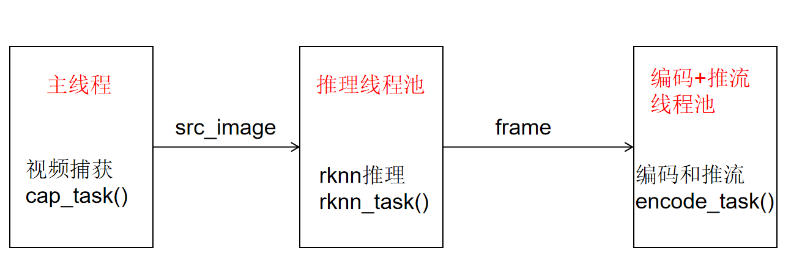

代码想要成功运行，还要修改两个地方。第一个地方在`src/main.c`中

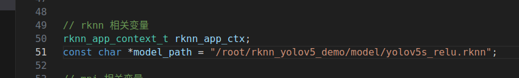

在这里，你需要将`mode_path`改成你板子上rknn模型的位置。

第二个地方在`src/postprocess.cc`中

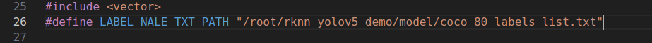

将`LABEL_NALE_TXT_PATH`这个宏定义改成你板子上coco标签文件的位置。


#### 2.1 视频捕获任务

```c
void capture_task() {
	
	// 视频图像帧信息结构体，存储采集视频帧
	VIDEO_FRAME_INFO_S stViFrame;
	// get vi frame
	RK_S32 s32Ret = RK_MPI_VI_GetChnFrame(0, 0, &stViFrame, -1);
	if(s32Ret == RK_SUCCESS) {

		image_buffer_t src_image;
		src_image.width = stViFrame.stVFrame.u32Width;
		src_image.height = stViFrame.stVFrame.u32Height;
		src_image.format = IMAGE_FORMAT_YUV420SP_NV12;
		src_image.virt_addr = reinterpret_cast<unsigned char*>(RK_MPI_MB_Handle2VirAddr(stViFrame.stVFrame.pMbBlk));
		src_image.size = RK_MPI_MB_GetSize(stViFrame.stVFrame.pMbBlk);
		src_image.fd = RK_MPI_MB_Handle2Fd(stViFrame.stVFrame.pMbBlk);

		rknnPool.enqueue(rknn_task, src_image);
		// rknn_task(src_image);

	}
	
	s32Ret = RK_MPI_VI_ReleaseChnFrame(0, 0, &stViFrame);
	if (s32Ret != RK_SUCCESS) {
		RK_LOGE("RK_MPI_VI_ReleaseChnFrame fail %x", s32Ret);
	}

	
}
```

视频捕获任务`capture_task()`运行在`main`函数里的`while`循环里，用于不停的捕获视频帧。

```c
RK_S32 s32Ret = RK_MPI_VI_GetChnFrame(0, 0, &stViFrame, -1);
```

这个函数就是捕获一帧图像，存储到变量`stViFrame`里，`stViFrame`变量的类型是`VIDEO_FRAME_INFO_S`，我们需要将他转为`image_buffer_t`结构体类型，`image_buffer_t`类型是yolov5推理所使用的类型。

```c
src_image.width = stViFrame.stVFrame.u32Width;
src_image.height = stViFrame.stVFrame.u32Height;
src_image.format = IMAGE_FORMAT_YUV420SP_NV12;
src_image.virt_addr = reinterpret_cast<unsigned char*>(RK_MPI_MB_Handle2VirAddr(stViFrame.stVFrame.pMbBlk));
src_image.size = RK_MPI_MB_GetSize(stViFrame.stVFrame.pMbBlk);
src_image.fd = RK_MPI_MB_Handle2Fd(stViFrame.stVFrame.pMbBlk);
```

然后将`src_image`输送到推理线程队列中去

```c
rknnPool.enqueue(rknn_task, src_image);
```

这个时候推理线程池里就会有线程开始执行推理任务。


#### 2.2 yolov5推理任务

```c
void rknn_task(image_buffer_t src_image) {

	// 执行推理 
	object_detect_result_list od_results;
	int ret = inference_yolov5_model(&rknn_app_ctx, &src_image, &od_results);
	if (ret != 0)
	{
		printf("inference_yolov5_model fail! ret=%d\n", ret);
	}

	// 画框和概率
	char text[256];
	for (int i = 0; i < od_results.count; i++)
	{
		object_detect_result *det_result = &(od_results.results[i]);
		printf("%s @ (%d %d %d %d) %.3f\n", coco_cls_to_name(det_result->cls_id),
				det_result->box.left, det_result->box.top,
				det_result->box.right, det_result->box.bottom,
				det_result->prop);
		int x1 = det_result->box.left;
		int y1 = det_result->box.top;
		int x2 = det_result->box.right;
		int y2 = det_result->box.bottom;

		draw_rectangle(&src_image, x1, y1, x2 - x1, y2 - y1, COLOR_BLUE, 3);

		sprintf(text, "%s %.1f%%", coco_cls_to_name(det_result->cls_id), det_result->prop * 100);
		draw_text(&src_image, text, x1, y1 - 20, COLOR_RED, 10);
	}

	// 转换为RGB888格式
	cv::Mat yuv420sp(height + height / 2, width, CV_8UC1, src_image.virt_addr);
	cv::Mat frame(height, width, CV_8UC3);			
	cv::cvtColor(yuv420sp, frame, cv::COLOR_YUV420sp2BGR); // COLOR_YUV2RGB_NV12

	h264encPool.enqueue(encode_task, frame);
	// encode_task(frame);

}
```

这里主要讲一下以下部分：

```c
// 转换为RGB888格式
cv::Mat yuv420sp(height + height / 2, width, CV_8UC1, src_image.virt_addr);
cv::Mat frame(height, width, CV_8UC3);			
cv::cvtColor(yuv420sp, frame, cv::COLOR_YUV420sp2BGR); // COLOR_YUV2RGB_NV12

h264encPool.enqueue(encode_task, frame);
```

因为采集到的视频帧是YUV420SP格式的，我们需要借助opencv将其转为RGB格式，得到Mat类型的frame变量，然后将其输送到编码和推流线程池队列中。


#### 2.3 编码以及推流任务

```c
void encode_task(cv::Mat frame) {

	sprintf(fps_text, "fps = %.2f", fps);		
	cv::putText(frame, fps_text,
					cv::Point(40, 40),
					cv::FONT_HERSHEY_SIMPLEX,1,
					cv::Scalar(0,255,0),2);


	memcpy(data, frame.data, width * height * 3);
		
	/**************************
	 * 向VENC发送原始图像进行编码
	 * 0为编码通道号
	 * h264_frame 为原始图像信息
	 * -1 表示阻塞，发送成功后释放
	 **************************/	
	RK_MPI_VENC_SendFrame(0, &h264_frame, -1);

	/**************************
	 * 获取编码码流
	 * 0为编码通道号
	 * stFrame为码流结构体指针 
	 * -1 表示阻塞，获取编码流后释放
	 **************************/
	RK_S32 s32Ret = RK_MPI_VENC_GetStream(0, &stFrame, -1);	
	
	if(s32Ret == RK_SUCCESS) {

		void *pData = RK_MPI_MB_Handle2VirAddr(stFrame.pstPack->pMbBlk);
		uint32_t len = stFrame.pstPack->u32Len;

		// 推流
		static int64_t time_last = 0;
		// 获取当前时间点
		auto now = std::chrono::system_clock::now();
		// 转换为自1970年1月1日以来的毫秒数
		auto duration = std::chrono::duration_cast<std::chrono::milliseconds>(now.time_since_epoch());
		// 获取毫秒级时间戳
		int64_t timestamp = duration.count();

		int64_t fps_time = timestamp - time_last;
		fps = 1000 / fps_time;

		time_last = timestamp;

		mk_frame frame = mk_frame_create(MKCodecH264, timestamp, timestamp, (char*)pData, (size_t)len, NULL, NULL);
		mk_media_input_frame(media, frame);
		mk_frame_unref(frame);
	}

	s32Ret = RK_MPI_VENC_ReleaseStream(0, &stFrame);
	if (s32Ret != RK_SUCCESS) {
		RK_LOGE("RK_MPI_VENC_ReleaseStream fail %x", s32Ret);
	}


}
```

首先在`frame`上添加fps数值，然后将`frame`的数据地址`frame.data`拷贝给`data`变量。接下来就是进行编码和推流，推流主要是下面三行代码：

```c
mk_frame frame = mk_frame_create(MKCodecH264, timestamp, timestamp, (char*)pData, (size_t)len, NULL, NULL);
mk_media_input_frame(media, frame);
mk_frame_unref(frame);
```

这里其实挺有意思的，为什么将图像拷贝给`data`变量，就能实现编码了，感兴趣的小伙伴可以理解下`rockit`实现硬件编码的这一部分代码。


### 3.交叉编译项目并拷贝到板端执行

编译和之前的步骤是一样的，首先将`CMakeList.txt`里面的交叉编译器部分修改成你自己的，然后进入build下编译。

编译出来的可执行文件`rk_cmake_project`就是我们要拷贝到板端运行的程序。

在运行之前，确保以下几点：

1.所有相关的动态库都已经拷贝到板端，可以直接把项目下的lib里面的全部`.so`文件拷贝到板端的`usr/lib`目录下

2.模型和标签文件拷贝到板端，并且代码中位置设置正确

3.设置板子的静态ip地址，保证和电脑ip在同一网段

接下来插入网线，打开VLC media player软件，没有的可以去网上下载，这个软件是免费的。

点击左上角 `媒体-打开网络串流`，然后输入URL

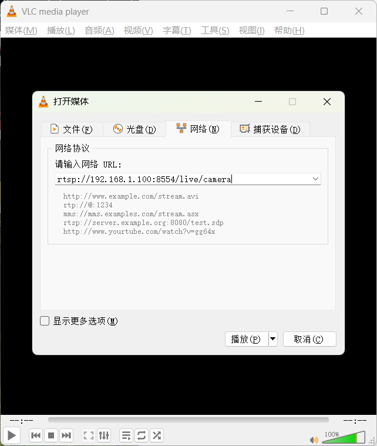

URL的格式是`rtsp://ip:8554/live/camera`，其中ip就是你开发板的静态ip地址，我设置成了`192.168.1.100`，所以我输入的URL就`是rtsp://192.168.1.100:8554/live/camera`，这个时候在板端运行程序，电脑端点击播放按钮，过一小会你就能看到画面啦！


## 四、总结

这个项目的难度并不大，主要是看目前网络上关于立创泰山派这一款开发板的摄像头，AI应用的开源项目不多，所以博主便想着抛砖引玉以下，写下了这篇文章，其中肯定有写的不好的地方，还请大家批评指正。

其实可以对这个项目进行进一步扩展，比如做一个车牌识别，人流量统计，人脸识别门禁等等，这样去完整的解决某一个具体领域里的问题，个人认为写进简历里对找工作还是很有帮助的。

